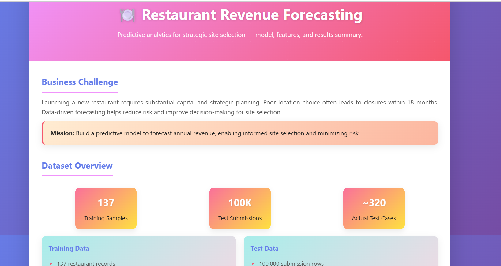

# Restaurant Revenue Forecasting

> Predictive analytics for strategic site selection — model, features, and results.

  

  <a href="https://dineshbarri.github.io/Kaggle_Restaurant_Revenue_Prediction/" target="_blank">🔗 Live Demo</a> •
  <a href="https://github.com/dineshbarri/Kaggle_Restaurant_Revenue_Prediction">📁 Source</a>

